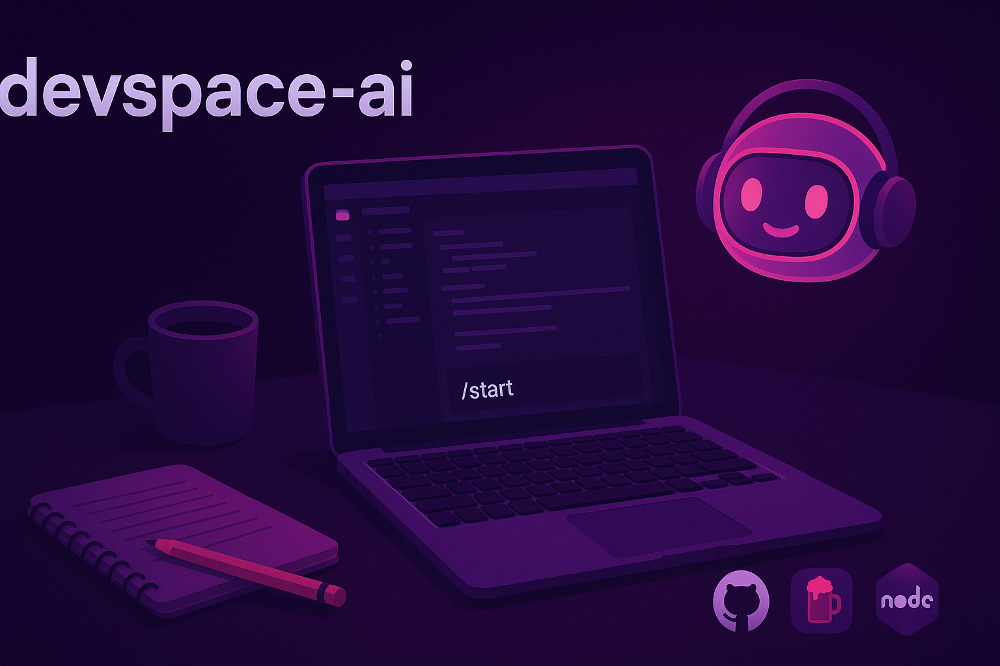

<div align="center">

# 🚀 devspace-AI

### PREPARE YOUR 🍏 Mac FOR DEVELOPMENT </br> with GitHub Copilot assistant

🎯 Follow this guide and **Copilot**

⚡ Type `/start` ~30min to ready

🔰 No prior knowledge: just follow the guide

### 🇬🇧 [🇫🇷](docs/ALIRE.md)



# 🏁 GET STARTED 🏁

</div>

### 1️⃣ Create GitHub account & activate Copilot

- Create an account on [github.com](https://github.com) and activate your [Copilot subscription](https://github.com/features/copilot/plans) — you can use the free plan

### 2️⃣ Check curl

- `curl` downloads files from the internet via terminal — usually pre-installed on Mac

```sh
curl --version
# should show: curl 8.7.1 or higher
```

- If `curl` isn't installed, see [curl.se](https://curl.se)

### 3️⃣ Install Homebrew

- Mac's package manager (like an app store for developers)

```sh
/bin/bash -c "$(curl -fsSL https://raw.githubusercontent.com/Homebrew/install/HEAD/install.sh)"
```

- ⏱️ Takes ~10 min

- **After installation**, add Homebrew to your PATH (the installer will show these commands):

```sh
echo 'eval "$(/opt/homebrew/bin/brew shellenv)"' >> ~/.zprofile
eval "$(/opt/homebrew/bin/brew shellenv)"
```

### 4️⃣ Install Visual Studio Code

- Your code editor — Copilot lives here

```sh
brew install --cask visual-studio-code
```

### 5️⃣ Clone devspace-AI

- Create a folder and download this project:

```sh
mkdir -p ~/Developer/devspace-AI
cd ~/Developer/devspace-AI
git clone https://github.com/punkyard/devspace-ai.git .
```

- **Note:** if `git` wasn't installed yet, install it first:

```sh
brew install git
```

### 6️⃣ Open in VS Code and type `/start`

- launch VS Code
- click **File** > **Open folder...**
- navigate to `~/Developer/devspace-AI` and click **Open**
- click your profile icon (bottom left) and sign in with GitHub
- open the chat box (`Alt+Cmd+B` or `Option+Cmd+B`)
- type: `/start`


<details>
<summary><strong>🤔 What is all this stuff by the way?</strong></summary>

### git
**What:** version control — tracks every change you make to code  
**Why:** collaborate with others, undo mistakes, keep history, publish on GitHub  
**In practice:** save your work at important moments, go back if something breaks, share code with teammates

### Node.js + npm
**What:** JavaScript runtime + package manager (like an app store for code libraries)  
**Why:** many modern projects need it; npm installs pre-made code others wrote  
**In practice:** run JavaScript code on your Mac, download useful tools instead of writing them from scratch

### NVM
**What:** Node Version Manager — lets you switch between different Node.js versions  
**Why:** different projects need different versions  
**In practice:** some projects work with Node 16, others need Node 18 — NVM lets you switch without breaking anything

### GitHub Copilot
**What:** AI assistant that writes code with you  
**Why:** explains code, suggests solutions, helps you learn faster  
**In practice:** you describe what you want, Copilot writes it, you learn how it works

### MCP Servers
**What:** Model Context Protocol — connections that give Copilot superpowers  
**Why:** search the web, read docs, access tools — all inside VS Code  
**In practice:** ask Copilot a question, it searches the web for the answer and explains it to you — no tab-switching needed

**MCP servers configured in this project:**
- **Time MCP:** canonical UTC timestamps and timezone conversions (no API key required)
- **Brave Search MCP:** real-time web search from VS Code
- **Context7 MCP:** instant access to documentation for libraries and frameworks

### Homebrew
**What:** macOS package manager  
**Why:** installs developer tools easily  
**In practice:** instead of downloading installers manually, use `brew install` commands

### curl
**What:** command-line tool for transferring data with URLs  
**Why:** downloads files and scripts from the internet via terminal  
**In practice:** used to install Homebrew and other tools

</details>


<div align="center">

# 📋 after you `/start`

</div>

### **Copilot guides you through:**

1. 💬 **questions about your Mac**  
   <sub>identifies your environment, stored in `context/environment.md`</sub>

2. 🛠️ **install Git, Node.js (LTS), and NVM**  
   <sub>version manager for Node via installer script</sub>

3. 🔑 **create API keys**  
   <sub>for Brave Search MCP ([free](https://brave.com/search/api/)) and Context7 MCP ([free, optional](https://context7.com))</sub>

4. ⚡ **set up MCP servers**  
   <sub>Brave Search (web search) + Context7 (docs access)</sub>

5. 🧪 **test your first prompt**  
   <sub>write a prompt, see Copilot work</sub>

6. ✅ **done!**  
   <sub>your Mac is production-ready</sub>

🔒 Each step asks for your confirmation before running: **You're in control.**

<div align="center">

# 💡 What you'll be able to do next

</div>

> 🚀 **Start Building**: clone [boilerspace-ai](https://github.com/punkyard/boilerspace-ai) templates for AI-assisted projects
>
> 🌐 **Search & Code**: Web search in your editor with Brave MCP, no tab-switching
>
> 👥 **Join & Learn**: follow communities like [Dev.to](https://dev.to), [Hashnode](https://hashnode.com), local meetups
>
> 📥 **Download & Study**: clone projects from GitHub, see how real code works
>
> 🤝 **Code with AI**: Copilot explains each line as you write or codes for you
>
> 📰 **Stay updated**: Follow [daily.dev](https://daily.dev), [Code Report](https://www.youtube.com/@CodeReport)


<div align="center">

## 🔒 Important notes

</div>

- **API keys are safe:** we use VS Code inputs and environment variables (never committed to GitHub)
- **you stay in control:** each step asks for your confirmation
- **open source:** see `.github/copilot-instructions.md` for the full ruleset
- **canonical docs:** all Copilot rules live in `.github/` folder (the Single Source of Truth)
- **file structure:** folder structure and instruction files are indexed in `.github/copilot-instructions.md`

<div align="center">

## 🐛 Found an issue?

</div>

- **problems during setup?** [open an issue](https://github.com/punkyard/devspace-ai/issues)
- **have an idea?** suggest it in [Discussions](https://github.com/punkyard/devspace-ai/discussions)
- **roadmap:** see [GitHub Issues](https://github.com/punkyard/devspace-ai/issues?q=is%3Aissue+is%3Aopen+label%3Aenhancement) for planned features

---

<div align="center">

License: GNU Affero General Public License v3 (AGPLv3) — see [LICENSE]()</br>

made with ⏳ by <a href="https://github.com/punkyard">punkyard

</div>
